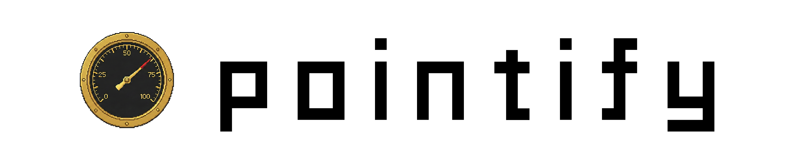
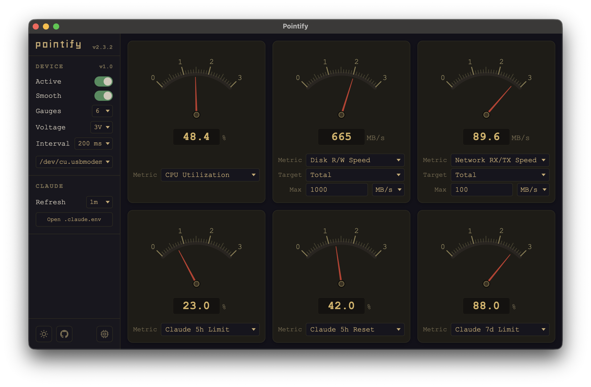
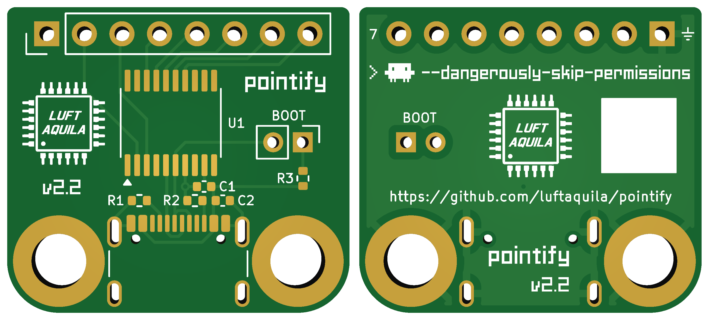
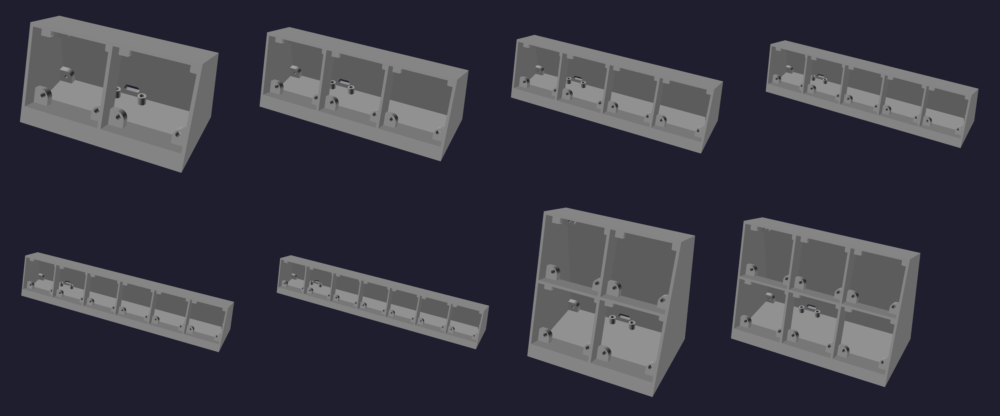
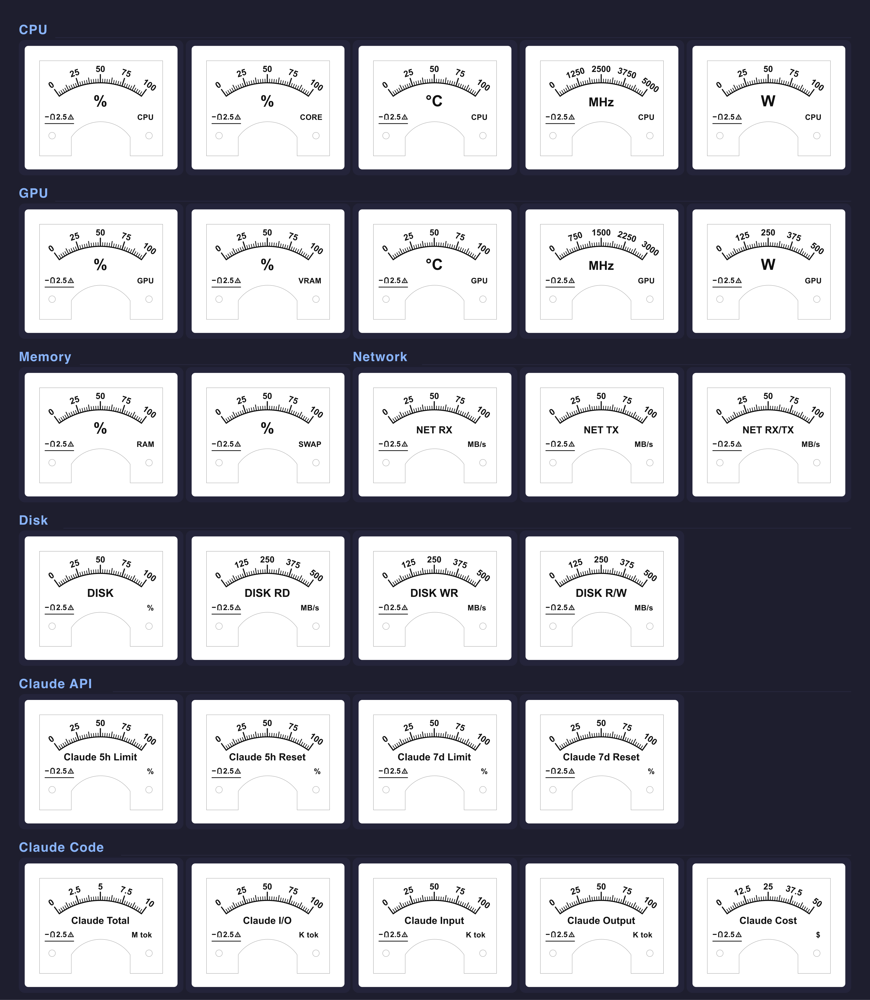

# Pointify



DIY retro analog gauge meters that display system metrics in real time, including Claude usage stats!

<table>
  <tr>
    <td>
      
    </td>
    <td>
      <video src="https://github.com/user-attachments/assets/7dd133b8-86af-4e1a-b1fe-1c4ecdfecce1" controls></video>
    </td>
  </tr>
</table>

## Usage

Pointify Desktop runs on macOS, Windows, and Linux, driving up to 7 gauges with customizable metrics.

Its software gauges work without the device, but watching real needles twitch is way better. So go build one!



1. Install Pointify Desktop and open it.
    * **macOS / Linux (Homebrew)**
      ```bash
      brew tap luftaquila/pointify https://github.com/luftaquila/pointify
      brew install --cask pointify # macOS
      brew install pointify        # Linux
      ```
    * **Windows (Manual)**: Download from the [latest release](https://github.com/luftaquila/pointify/releases/latest).
1. Connect your Pointify to the computer and set up gauges to your preference.

<details>

<summary>Full list of supported metrics</summary>

- 🕹️ Hardware
  - CPU
    - Utilization
    - Temperature
    - Clock Frequency
    - Power Consumption
  - GPU
    - Utilization
    - Temperature
    - Clock Frequency
    - Power Consumption
    - VRAM Usage
  - Memory
    - RAM and Swap Usage
  - Network
    - RX, TX and RX/TX Speed
  - Disk
    - Usage
    - Read, Write and R/W Speed
- **🤖 Claude Usage Stats**
  - Usage Limits
    - 5h session limit and reset time
    - Weekly limit and reset time
  - Claude Code stats
    - Today's total tokens
    - Today's input, output and I/O tokens
    - Today's cache read and write tokens
    - Today's cost ($)

</details>

> [!NOTE]
> Some metrics have platform/hardware limitations.
> * **CPU Temperature and Power**: Not available on Windows.
> * **GPU metrics**: Not supported on AMD graphics cards.
> * **GPU VRAM Usage**: Not available on Apple Silicon.

### Optional setup

To fetch Claude usage limits (5h session and weekly), Pointify needs your browser credentials.

Claude Code stats are collected from local logs and do not require credentials.

> [!NOTE]
> Credentials are stored locally and only used to fetch usage data directly from Claude. No information is sent to any third-party server.
> See the `get_claude_usage` function in [lib.rs](https://github.com/luftaquila/pointify/blob/v2/gui/src-tauri/src/lib.rs) for details.

<details>

<summary>Firefox</summary>

1. Open Firefox and visit `https://claude.ai`. Log in if you haven't already.
1. Open Developer Tools (F12).
1. Go to the `Storage` tab.
1. On the left sidebar, click `Cookies` - `https://claude.ai`.
1. Locate the `cf_clearance`, `lastActiveOrg`, and `sessionKey` values.
1. Click the `Open .claude.env` button on the desktop app and paste the corresponding values.

</details>

<details>

<summary>Chrome</summary>

1. Open Chrome and visit `https://claude.ai`. Log in if you haven't already.
1. Open Developer Tools (F12).
1. Go to the `Application` tab.
1. On the left sidebar, click `Storage` - `Cookies` - `https://claude.ai`.
1. Locate the `cf_clearance`, `lastActiveOrg`, and `sessionKey` values.
1. Click the `Open .claude.env` button on the desktop app and paste the corresponding values.

</details>

## Do It Yourself!

Pointify is fully open-source and open-hardware. Build your own device at home!

### 1. Build PCB



1. Download `pointify-hardware.zip` from the [latest release](https://github.com/luftaquila/pointify/releases/latest) and unzip.
1. Gerber, BOM, and CPL files are in the `pcb/` directory. Use them to place a PCB assembly order from manufacturers such as JLCPCB.

### 2. Upload Firmware

If your board is fresh and the MCU has never been flashed, it will always boot into USB bootloader mode.

1. Connect your board to the computer.
1. Open Pointify Desktop and click the chip icon at the bottom of the sidebar.

`CURRENT` version will show as `Bootloader`. Click the `Update Firmware` button to flash it.

> [!NOTE]
> If your computer is running Windows and `CURRENT` shows as `N/A`, it means the CH372 driver is missing.
> Press the `Shift` key and the button will change to `Update Firmware (force)`.
> The force install process will automatically detect and install the missing driver.
> Alternatively, you can install the driver manually from [here](https://www.wch-ic.com/downloads/CH372DRV_EXE.html).

### 3. 3D-Print Housing and Assembly

#### Prerequisites

* 6x M2*8mm bolts
* 91C4 3V DC analog voltmeters, as many as you need
* Some wires and soldering skills
* 4x anti-slip pads with radius < 10mm



1. Download `pointify-hardware.zip` from the [latest release](https://github.com/luftaquila/pointify/releases/latest) and unzip.
1. 3D-print the STL files you need from the `3d/` directory.
1. Install the gauges into the housing.
1. Connect all negative terminals (near the 0V scale) of the gauge to the GND header on the PCB.
    * Daisy-chain them, since there's only one GND pad (marked ⏚).
1. Connect each positive terminal (near the 3V scale) to PWM port #1~7 on the PCB.
    * The pad right next to the GND is PWM1.
    * Solder directly to the washer that comes with the gauge, or crimp a ring terminal onto the wire. Crimping is easier to work with but you'll need a crimp tool and ring terminals.
1. Mount the PCB upside down onto the housing. The USB port faces downward.
1. Attach the back cover.

### 4. Customize Gauge Panel

Use the [Gauge Panel Generator](https://luftaquila.github.io/pointify/generator.html) to design and print your own gauge panel graphics.

Examples from the [device/gauge/example/](device/gauge/example) directory:



## Development

<details>

<summary>Open</summary>

### Desktop App

Requires [Node.js](https://nodejs.org/en/download) and [Rust](https://rust-lang.org/tools/install/).

```bash
cd gui
npm install
npm run tauri dev       # development
npm run tauri build     # production
```

### Firmware

Requires [nightly Rust](https://rust-lang.github.io/rustup/concepts/channels.html#working-with-nightly-rust).

```bash
cargo install wchisp --git https://github.com/ch32-rs/wchisp

cd device/firmware
cargo build --release   # build only
cargo run --release     # build + flash
```

</details>

<hr>
<br>

<picture>
  <source media="(prefers-color-scheme: dark)" srcset="https://api.star-history.com/svg?repos=luftaquila/pointify&type=Date&theme=dark" />
  <source media="(prefers-color-scheme: light)" srcset="https://api.star-history.com/svg?repos=luftaquila/pointify&type=Date" />
  
</picture>

