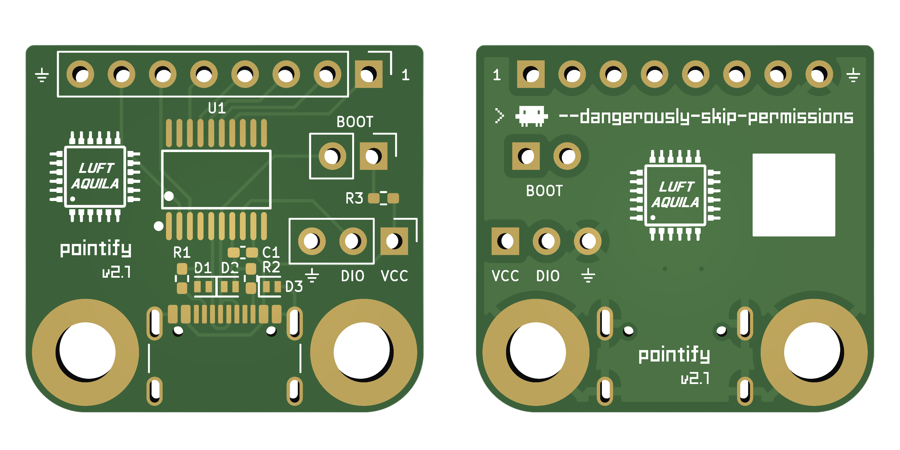

# Pointify


DIY retro analog gauge meters that display your system metrics in real time, including Claude usage stats!

## Features

Supports Linux, macos, and Windows.

Up to 7 gauges with customizable metrics:

- 🕹️ Hardware
  - CPU
    - Utilization
    - Temperature
    - Core Frequency
  - Memory
    - RAM Usage
    - Swap Usage
  - GPU
    - Utilization
    - Temperature
    - Power
    - VRAM Usage
  - Network
    - RX Speed
    - TX Speed
    - RX/TX Speed
  - Disk
    - Usage
    - I/O Speed
- **🤖 Claude Usage Stats**
  - Usage Limits
    - 5h session limit
    - 5h session reset time
    - Weekly limit
    - Weekly reset time
  - Claude Code stats
    - Today's total tokens (with cache)
    - Today's I/O tokens
    - Today's input / output tokens
    - Today's cache write / read tokens
    - Today's cost ($)

## Usage

1. Install Pointify Desktop from the [latest release](https://github.com/luftaquila/pointify/releases).
1. Connect your device to the computer.
1. Launch Pointify Desktop and select your device from the `Serial Port` in the sidebar.

> [!NOTE]
> The following metrics have some limitations.
> * CPU Temperature: Not available on Windows.
> * GPU metrics: Not supported for AMD graphics cards.
> * GPU VRAM Usage: Not available on Apple Silicon.

### Optional setup

To fetch Claude usage limits (5h session and weekly), Pointify needs your browser credentials.

Claude Code stats are collected from local logs and do not require credentials.

> [!IMPORTANT]
> Credentials are stored locally and only used to fetch usage data directly from Claude. No information is sent to any third-party server.
> See the `get_claude_usage` function in [lib.rs](https://github.com/luftaquila/pointify/blob/v2/gui/src-tauri/src/lib.rs) for details.

> [!TIP]
> The location of the `.claude.env` varies by OS.
> * Linux: *$HOME/.config/pointify*
> * macOS: *$HOME/Library/Application Support/pointify*
> * Windows: *%USERPROFILE%\AppData\Roaming\pointify*
<details>

<summary>Firefox</summary>

1. Open Firefox and visit `https://claude.ai`. Log in if you haven't already.
1. Open Developer Tools (F12).
1. Go to the `Storage` tab.
1. On the left sidebar, click `Cookies` - `https://claude.ai`.
1. Locate the `cf_clearance`, `lastActiveOrg`, and `sessionKey` values.
1. Click the `Open .claude.env` button on the desktop app and paste the corresponding values.

</details>

<details>

<summary>Chrome</summary>

1. Open Chrome and visit `https://claude.ai`. Log in if you haven't already.
1. Open Developer Tools (F12).
1. Go to the `Application` tab.
1. On the left sidebar, click `Storage` - `Cookies` - `https://claude.ai`.
1. Locate the `cf_clearance`, `lastActiveOrg`, and `sessionKey` values.
1. Click the `Open .claude.env` button on the desktop app and paste the corresponding values.

</details>

## Do It Yourself!

Pointify is an open-source and open-hardware project. You can build your own Pointify device at home.

### Build PCB



KiCad schematics and PCB layout files are in [device/hardware/](https://github.com/luftaquila/pointify/tree/v2/device/hardware).

### Upload Firmware

### 3D-Print Housing and Assembly

## Development

<details>

<summary>Open</summary>

### Desktop App

Requires [Node.js](https://nodejs.org/en/download) and [Rust](https://rust-lang.org/tools/install/).

```bash
cd gui
npm install
npm run tauri dev       # development
npm run tauri build     # production
```

### Firmware

Requires [nightly Rust](https://rust-lang.github.io/rustup/concepts/channels.html#working-with-nightly-rust).

```bash
cargo install probe-rs-tools

cd device/firmware
cargo build --release   # build only
cargo run --release     # build + flash
```

</details>

